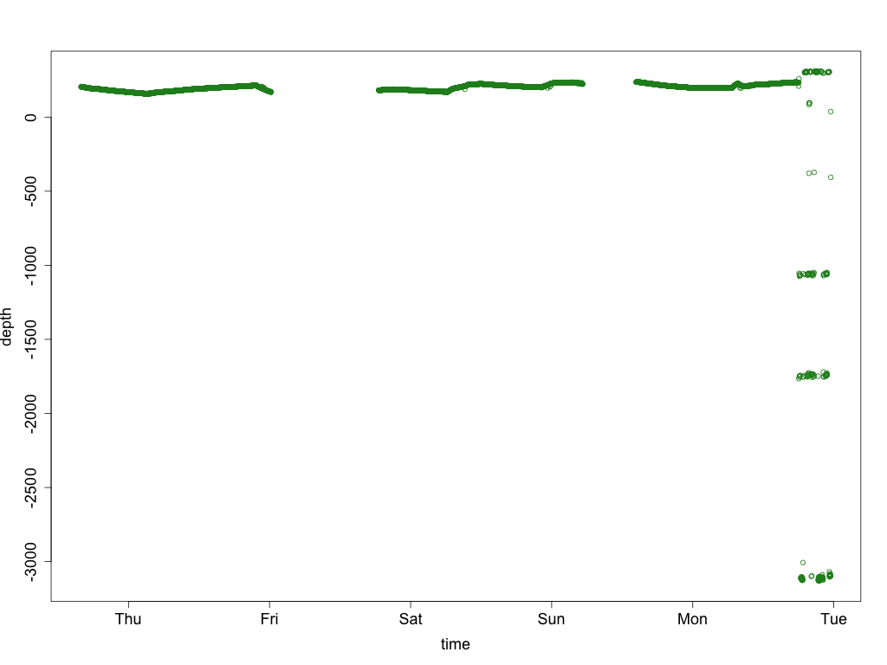

# Water Level Sensor Project
###### Dr Matthew Berryman, Dr Etienne Turpin, Dr Tomas Holderness, Mr Robert Ogie, Mr Frank Sedlar, Dr Nagesh Shukla
30th September 2016

# 1. Background
[PetaJakarta.org](https://petajakarta.org) is an open source, open data web application for flood mapping
in Jakarta. In the 2014–2015 monsoon we partnered with the [Jakarta Emergency Management Agency](http://bpbd.jakarta.go.id/) (BPBD DKI Jakarta) and [Twitter](https://twitter.com) in order to map social media data on flooding. More background on the work in that monsoon may be found in our [first white paper](https://petajakarta.org/banjir/en/research). For the 2015–2016 monsoon we added  [Qlue](http://www.qlue.co.id/) and [Detik Pasangmata](http://www.detik.com/)  as social media partners, mapping their social media reports on flooding, plus we also built a secure, custom interface (the [Cognicity Risk Evaluation Matrix](https://github.com/smart-facility/cognicity-rem-server)) for [BPBD DKI Jakarta](http://bpbd.jakarta.go.id/) to create a real-time flood depth map based on resident and emergency services reports.

Thanks to a Department of Foreign Affairs and Trade (DFAT) grant (agreement number 71984) we were able to successfully trial the use of prototype Internet of Things (IoT) water level sensors. Additionally, with the same funding we were also able to trial the use of QR codes for automatically generated flood reports, and also conduct field testing of our Pebble FloodWatch app, which has now been published in the Pebble watch app store for general use. Brief descriptions of the IoT sensors, QR code and watch app are included below, followed by a more detailed report of the main component of the grant, IoT water level sensors.

## 1.1. IoT water level sensors
With the explosion in hardware for Internet of Things devices, in particular the [Arduino](https://www.arduino.cc) and [Raspberry Pi](https://www.raspberrypi.org/) platforms, along with software and networking suites like [Amazon Web Services'](https://aws.amazon.com/) [Internet of Things Service](https://aws.amazon.com/iot/), it is possible to build a relatively cheap network of sensors to provide information on water level, to complement the small number of manual gauges (manual gauges shown in Figure 1.1). While the work undertaken in this grant was proof-of-concept, with a production scale deployment using the next version of our sensors, the data collected would support flood gate and water pump operators to make better decisions about the waterway network for better management, reducing the risk and impact of flooding during the city's annual monsoon season. Figures 1.2 and 1.3 show the gate and water pump locations respectively. Further details of our sensor work are included below in Section 2.

**Figure 1.1: Location of manual water level gauges.**
 

**Figure 1.2: Location of water gates.**
 

**Figure 1.3: Location of water pumps**
 

## 1.2. QR codes
In the first version of the PetaJakarta.org platform, Twitter users were able to submit reports of flooding to the map using the native geolocation data provided by the Twitter application. However in 2015 Twitter changed the behaviour of their geolocation services so that the default location provided is a generalised area of varying size depending on the user location. Precise geolocation is still available, but requires advanced configuration by the user to enable.

To address this issue we came up with the idea of installing custom quick response (QR) codes in key public locations that pre-fill tweets with a unique location ID that can later be translated into geospatial co-ordinates. Figure 1.2.1 shows the QR code in place in our test locations, and Figure 1.2.2 shows the resulting pre-filled tweet. Through the QR code we have pre-filled a tweet using a unique *lokasi* (location) ID, in this case 001. Further work is required to geolocate these reports and add to the PetaJakarta.org database, before such a system could be deployed in production. This proof of concept demonstrates one additional method that could be used to collect geo-located information from residents on either flooding or specific infrastructure performance via social media.

**Figure 1.2.1: Unique QR code containing a unique location for its location.**
 

**Figure 1.2.2: Pre-filled tweet with a unique location ID.**
 

## 1.3. FloodWatch Pebble app
Through the work of a summer scholarship student, Hasitha Jayanandana, and Dr Tomas Holderness and Dr Matthew Berryman, we developed a watch app for [Pebble watches](https://pebble.com), [FloodWatch](https://apps.getpebble.com/en_US/application/57b3722fbb85eddc98000636), which will display a list of social media reports within a 5 km radius around the user. The source code for the watch app can be found at [https://github.com/smart-facility/cognicity-floodwatch/](https://github.com/smart-facility/cognicity-floodwatch/). Figure 1.3 shows the successful trial of the watch app in Jakarta. This proof of concept demonstrates another facet of  current IoT technology and how this could be deployed to support disaster resilience in a megacity environment. Further work should include linking of the Pebble reports app to collect data from nearby IoT flood sensors, warning the user of rising river levels.

**Figure 1.3: FloodWatch app showing test flood report.**
 

# 2. Implementation of IoT sensors
Implementation of the IoT sensors consisted of three phases:
1. Design of the sensors and sensor software,
2. Deciding on the optimal location to place the sensors, and
3. Installation, including testing.

## 2.1. Design of IoT sensors
The IoT sensors that we deployed in Jakarta needed to meet a number of engineering constraints:
* Deliver reliable measurements of water level,
* Be able to transmit data back to the PetaJakarta database,
* Be low cost,
* Be weatherproof, and
* Reasonably theft resistant.

For the computing unit, we selected the Raspberry Pi. Although more power-hungry than Arduino-based units, it presents as a full microcomputer running the Linux operating system with all the usual systems administration tools, including the ability to manage processes, so that we could automatically start up, maintain, and log our sensing software. In addition, the Raspberry Pi 3 is powerful enough to run the [Node.js](https://nodejs.org) JavaScript compiler for standalone applications (i.e. separate to use of JavaScript on web pages). The AWS IoT [Software Development Kit for Node.js](https://aws.amazon.com/sdk-for-node-js/) (SDK) is available as a [Node.js](https://nodejs.org) module, and the sensor devices we picked (as detailed below) also had Node.js libraries available. We had a high familiarity with Node.js from the rest of the Cognicity suite of software we wrote to drive PetaJakarta.org.

Transmitting data captured by the RaspberryPi back to the PetaJakarta.org database was relatively easy to achieve using AWS' IoT SDK. This allowed us to rapidly write some [software](https://github.com/smart-facility/cognicity-floodsensor/blob/master/device/device.js) to send encrypted sensor data to the cloud. We gave each sensor its own certificate and private key, thus if one sensor was stolen, we could revoke its certificate independently of the others, to prevent someone using that certificate from sending data from that sensor, while still allowing us to receive data from the other sensors. And appending spurious data to our database is the worst that someone could do, as defined in our policies held securely in AWS' data centre. Since AWS' IoT service doesn't natively support the [PostgreSQL](https://www.postgresql.org/) database that we use to run PetaJakarta.org, chosen for its support of geospatial operations, we wrote a ["Lambda" function](https://github.com/smart-facility/cognicity-floodsensor/blob/master/lambda/index.js) that is called every time data is received by AWS' IoT service, to put it into our database. This transmission is secured through the use of firewall and virtual networking rules along with encryption.

For sonar sensing of relative water level, we settled on the [HC-SR04](https://electrosome.com/hc-sr04-ultrasonic-sensor-raspberry-pi/) sonar units, as these are very cheap but quite reliable, up to their maximum range, which in the [data sheet](http://www.micropik.com/PDF/HCSR04.pdf) is stated as 4 metres, however in practice in both lab and field testing, it was found that the sensor struggles to provide an accurate reading at distances greater than 3.2m—this was accepted as the sensors practical maximum range. This constraint was hard to meet at a couple of locations in Jakarta, as we must also make sure the sensor is kept high enough so as to be at low risk of flooding as the water rises.

Since we settled on sonar range sensors for sensing the range to water level, we thought of adding in temperature sensing, with a view to improving the accuracy of the sonar distance calculation, since the speed of sound varies in a known relationship with the temperature. A cheap but reportedly reliable sensor for both temperature and humidity sensing is the [DHT22](https://www.adafruit.com/product/385) temperature and humidity sensor.

For weather proofing we first found cheap, light-weight plastic boxes, with a lid that screws in tightly to the base (Figure 2.1.1).

**Figure 2.1.1: Original plastic box of the type used for each sensor.**
 

Lab technicians from the University of Wollongong in collaboration with Dr Matthew Berryman designed a set of holes and mounting brackets to hold the sensors in place for installation in Jakarta, with only the necessary parts of the sensors exposed through tightly-fitting holes, and the rest of the sensor including the electronics sitting inside the box. Figures 2.1.2 and 2.1.3 show the sensors in their compartments.

**Figure 2.1.2: Box with sonar sensor in its compartment.**
 

**Figure 2.1.3: Box with DHT22 temperature and humidity sensor in its compartment.**
 

To then fully waterproof the boxes we needed to seal the holes in the bottom of the box (the top of the sensor), which we did with duct tape (Figure 2.1.4). This was ultimately successful as you can see our notes below (Figure 3.1.1).

**Figure 2.1.4: Sealing of holes in box with duct tape.**
 

## 2.2. Placement of IoT sensors
SMART Infrastructure Facility Research Fellows Dr Robert Ogie and Dr Nagesh Shukla, supported by Dr Tomas Holderness and Mr Frank Sedlar, developed a simple algorithm for optimal placement of the sensors, based around the following principles, all with distance (and hence density) being in the river network sense rather than strict distance:
1. The sensors should be placed away from the existing manual gauges,
2. The sensors should also be placed away from each other, and
3. The sensors should be placed in regions of high density of existing water flow control infrastructure (pumps and gates).

Genetic algorithms are widely used for optimisation problems and a multi-objective genetic algorithm, with formulas representing each of the above principles as the objectives, was used. This then gives what is known as a Pareto set of equally-optimal locations. We then had the task of picking and choosing from that set using the additional two constraints:
1. There must be some sort of infrastructure at or near the set of algorithmically-produced co-ordinates, and
2. The locations must also be relatively near to each other in terms of distance on the *road* network, to save our time in installing and maintaining the sensors.

However, additional constraint #1 turned out not to be an issue, due to the presence of a large number of locations with beams across the waterways of Jakarta, which carry electrical and other cables across the waterways.

Despite wanting to place the sensors away from manual gauges, we decided to place one at the same location as a manual gauge, for comparison. And despite taking over 5 sensors, we only got time to install a total of 4, as we decided to focus on collecting more data from those by battery replacement rather than get the 5th sensor in. It turned out the 5th then proved useful in demos to institutions in Indonesia and back in Australia, which has fostered relationships that allow us to test out future improvements in the hardware in areas that experience flooding issues.

Thus we arrived at the 4 locations shown in the Figure 2.2.1, the map of locations used.

**Figure 2.2.1: Map of sensor locations.**
 

## 2.3. Installation
The key to successful installation was figuring out how to mount the sensor from a beam while meeting the following constraints:
1. The box needs to be up-side-down and horizontal so that the sonar sensor can measure the direct distance to the water level, and
2. The box needs to be high enough to not be flooded as the water level rises, but low enough to be within the 3.2m practical range limit of the sonar sensors.

Meeting goal 1, and some measure of physical security, was achieved by the use of the metal cages, with a front section that can be opened for battery changes and then closed and locked again using a padlock. Construction of the metal cages is shown in Figure 2.3.1 with the end result as attached to a beam shown in Figure 2.3.2.

To make sure the boxes were high enough we assumed that the beams they were affixed to were unlikely to be at a height at serious risk of flooding, as many contained infrastructure like electrical and/or Internet cables, or water pipes. As an additional guide to placement, in most locations there was some staining on the edges of the waterway from typical water levels.

**Figure 2.3.1: Construction of metal cages.**
 

**Figure 2.3.2: Installation photo.**
 

More photos from our installation can be found [here](https://www.dropbox.com/sh/9a8zu4mfcke0j01/AABX7G66nQVHkeuzvxqbHs5va?dl=0).

As you'll see in the results below, the sensor units also have built-in theft detection, since to remove the unit, and before the unit can be powered off, someone must first make a major change to its position (and hence distance readings).

In each location we tested both the hardware and software. The issues we experienced and for the most part successfully resolved are outlined below.

# 3. Results
## 3.1. Issues experienced and general notes
On the first installation we found that if the temperature and humidity sensor was not read once every minute at least, it would read zero, and even then, it was still an occasional issue. We thus needed to perform a software update on the sensor to provide minute-by-minute data—the easiest way of doing this—but then needed to modify the web software to cope with this change so graphs weren't cluttered (more on that in subsection 3.2).

It would have been good if the sensor units updated their software automatically, rather than me having to load on new versions—this was a particular issue following the installation of sensor unit 1.

We had issues with 4G modems failing. This was likely the result of overheating in the hot conditions, given air temperature as well as the observed felt temperature of the modems.

The weatherproofing was ultimately successful, as you can see in Figure 3.1.1 where this sensor had been out in the field for several days including a number of rains showers, with no shelter from the beam it was mounted to, as this one was side mounted.

**Figure 3.1.1: Check on weather proofing of box.**
 

Batteries were a known issue, and while it was an easy 10 minute operation to change them over including removal and reinsertion of the sensor unit, plus testing, the near-continuously congested Jakarta traffic meant that significant time was spent just getting to the sensor sites. This issue will be addressed in future work (already started) to add in solar power.

Sensor 1 experienced loss of data connectivity during the first run. As observed on my mobile phone, while testing both the QR codes and watch app, the reception in the area was quite good, however [TCP/IP](https://en.wikipedia.org/wiki/Transmission_Control_Protocol) connections to web sites experienced high packet loss, resulting in at times dropped connections, and at other times very slow speeds. This strongly suggested that the base station (or its fibre backhaul) was overloaded. This hypothesis was further tested during data collection through the night, with no issues experienced once people went home, followed by the problem reappearing during the morning peak. Due to a flow-on effect of this problem onto the problem identified above with the temperature and humidity sensor, this meant a loss of temperature and humidity data (as indicated by zero readings) as you can see in Figures 3.2.5, and 3.2.6. This hypothesis that base station congestion issue was further confirmed, and the problem solved, by switching mobile providers at a later date.

At sites with sensors 1 and 4, the distance to the water was well out of range, in the case of sensor 1, and right at the maximum practical range, in the case of sensor 4. The locations had been scouted out as being suitable (including taking into account of the maximum practical range). However, at the site for sensor 1, the water level had dropped significantly from the time of scouting to the time of installation. At the site of sensor 4, the only locations definitely within range of the sonar were too low—below the level to which the water typically rises to as determined by the staining of the infrastructure—and there were no other obvious locations to attach to that were quite close enough ([video](https://www.youtube.com/watch?v=kNxeUdbjFTQ)). The location we finally chose was well-sheltered and easy to place the sensor in, even with holes that the sonar sensor could sense through ([video](https://www.youtube.com/watch?v=t1JxdHxvx7g)), however at 3.2m from sensor to water level (at the time we measured it), it was right on the limit of the sonar range sensor, resulting in some spurious readings—see unfiltered results below.

## 3.2. Data obtained
### Summary
The readings are (while the sensor is running) a minute a part, bearing in mind there are gaps from when the battery was run down to when the battery was replaced. If displayed on the web as is, then as previously noted there are too many points if displayed every minute, resulting in tick marks and *x* axis labels that are too close, so we have trialled displaying every 15 min, 30 min, and 1 hr. In future work we need to make this adaptive and also need to use a proper time series chart rather than just an x-y scatter or line plot. The data obtained from the first run of each sensor is displayed in the *web* subsubsection below. We can see from these graphs, as well as the graphs for all of the data (in unfiltered and filtered subsubsections as described below), that there is a diurnal variation in depth for each location. These did not correspond to the tides and nor did we really expect them to given the location of the sensors and the layout of the waterway network. Instead, we observed these seemed to correlate with the daily cycle of storm buildup, but with some delay, due to the time for water to flow downstream. In addition, we see some spikes in the depth data, which we are sure are trash objects going past or (for sensor 2) the pontoon (in Figure 2.3.2) situated almost underneath the sensor moving in and out. So, we have a trash detector as well as a water depth detector.

The full set of data collected is shown in the *unfiltered* subsubsection below. There are some stray values for both depth as well as temperature and humidity.

For sensors 1 and 4 in particular, there are some periods with stray depth measurements—these were expected for these  locations, in particular for sensor 1 where the distance from sensor to water level exceeds the maximum practical range of 3.2m, and sensor 4 is right on that maximum practical range. There is still some other stray data in all depth graphs, from where the sensor was either removed while running for a battery change, or removed for storage between runs. Only during battery replacements of a powered down unit was there a simple operation to clean data in situ. While this was unhelpful in analysis of water level data, it does prove useful in another way, in that when we have the units running, if we detect an unplanned major and sudden change in depth readings, it suggests the unit is being stolen; i.e. we also have theft detection as well as trash detection. Filtering the depth data with a simple filter to remove all depth data where the measured distance to water was more than 3.3m results in the depth graphs in the *filtered* subsubsection.

The unfiltered data for temperature and humidity, in the *unfiltered* subsubsection, shows a number of zeros across all sensors, which, with the exception of the first run of sensor 1, were from where we experienced the temperature and humidity sensor reliability issue, that we noted above as an intermittent issue. You can observe the ripple-on effect of the mobile congestion on the temperature and humidity readings in the first run of sensor 1 (Figures 3.2.5 and 3.2.6). Later runs have similar numbers of stray zeros as per the other sensors. Filtering the temperature and humidity to exclude zeros results in the graphs as in the *filtered* subsubsection. Other than these, the data was reliable, as compared with weather data at the time as well as pre-installation testing (not shown).

In general the filtered results look much better except for sensor 1 where there wasn't much reliable distance data to begin with. However, it does seem (in Figure 3.2.7) as if there is some sort of a water depth trend to sensor 1 but with random fluctuations between various set points and the trend overlaid on top of those.

The code for producing the graphs in the *unfiltered* and *filtered* subsubsections can be found at [https://github.com/smart-facility/cognicity-data-analysis](https://github.com/smart-facility/cognicity-data-analysis)

### web
**Figure 3.2.1: Web graph data from first run of sensor 1.**
 

**Figure 3.2.2: Web graph data from first run of sensor 2.**
 

**Figure 3.2.3: Web graph data from first run of sensor 3.**
 

**Figure 3.2.4: Web graph data from first run of sensor 4.**
 

## unfiltered

**Figure 3.2.5. Graph of unfiltered temperature data from sensor 1** 

**Figure 3.2.6. Graph of unfiltered humidity data from sensor 1** 

**Figure 3.2.7. Graph of unfiltered depth data from sensor 1** 

**Figure 3.2.8. Graph of unfiltered temperature data from sensor 2** 

**Figure 3.2.9. Graph of unfiltered humidity data from sensor 2** 

**Figure 3.2.10. Graph of unfiltered depth data from sensor 2** 

**Figure 3.2.11. Graph of unfiltered temperature data from sensor 3** 

**Figure 3.2.12. Graph of unfiltered humidity data from sensor 3** 

**Figure 3.2.13. Graph of unfiltered depth data from sensor 3** 

**Figure 3.2.14. Graph of unfiltered temperature data from sensor 4** 

**Figure 3.2.15. Graph of unfiltered humidity data from sensor 4** 

**Figure 3.2.16. Graph of unfiltered depth data from sensor 4** 

## filtered

**Figure 3.2.17. Graph of filtered temperature data from sensor 1** 

**Figure 3.2.18. Graph of filtered humidity data from sensor 1** 

**Figure 3.2.19. Graph of filtered depth data from sensor 1** 

**Figure 3.2.20. Graph of filtered temperature data from sensor 2** 

**Figure 3.2.21. Graph of filtered humidity data from sensor 2** 

**Figure 3.2.22. Graph of filtered depth data from sensor 2** 

**Figure 3.2.23. Graph of filtered temperature data from sensor 3** 

**Figure 3.2.24. Graph of filtered humidity data from sensor 3** 

**Figure 3.2.25. Graph of filtered depth data from sensor 3** 

**Figure 3.2.26. Graph of filtered temperature data from sensor 4** 

**Figure 3.2.27. Graph of filtered humidity data from sensor 4** 

**Figure 3.2.28. Graph of filtered depth data from sensor 4** 

# 4. Future Work and Conclusions
## 4.1. Outcomes & sustainability
Our IoT water level sensors have met our objectives and have proven useful at collecting generally accurate data, provided the key constraint around the maximum practical range of the sonar sensors is met. Battery life was the main limitation of our existing sensors. Both of these issues will be addressed and tested through real-world testing in Wollongong, before hopeful adoption in Jakarta and other flood-prone regions (subject to further funding). In particular, addressing the issue of power (which we have [already started](https://github.com/phenidone/cognicity-floodsensor/tree/hat-schematic) in conjunction with a collaborator) will help address environmental and operation sustainability.

## 4.2. Future Work
In future work we will be making the following improvements to sensors:
* Solar panels and power management, for much longer operation between battery changes, which is the main limiting factor for wider, longer term use of the sensors.
* Exploring other options for range sensing over longer distances.
* Scheduled software updating of both the operating system as well as the sensor software.
* Resolving the temperature and humidity sensor issues, either by software tweaks or selection of different hardware for that.
* Adopting LoRaWAN technology, providing for low power, long range communications, unaffected by mobile base station congestion. This is contingent on community groups / telecommunications companies / us installing LoRaWAN gateways in key locations.
* Update the web code to use a time series chart and make it adaptive based on the amount of data available.
* Further refine the data processing to:
  * remove known-inaccurate data, at least from display on the graph,
  * alerting if the depth goes above a set value, and
  * perform trash and theft detection.
* Conducting data analytics work to combine data we collect from a larger number of sensors, with the models we have of the waterway network, for better operation of infrastructure to minimise the risk of flooding.

In future work we will also be considering in more detail the value of QR codes for tweets, alongside our other options for obtaining precise geolocation.
